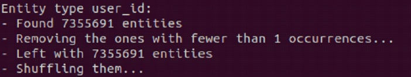
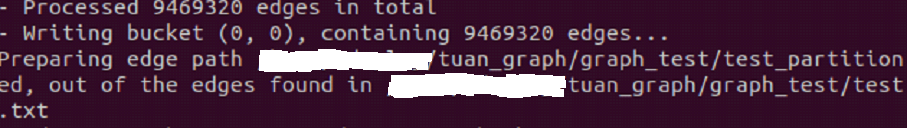

## Giới thiệu.

  

  *GraphSage Embedding Algorithm*

Trong các bài toán về graph, các thành phần thường sẽ có node (các điểm, hay entity ở một số bài báo) và edge (các cạnh). Mối quan hệ của các node với nhau sẽ được biểu hiện bởi cạnh. Bài viết này chủ yếu được tổng hợp từ [article này](https://arxiv.org/abs/1709.05584), nếu thích đọc tiếng anh thì có thể đọc ở bài báo đó.

Graph Embedding là một bài toán Unsupervised learning. Dựa trên các mối tính chất cũng như quan hệ node và edge trong một graph, graph embedding sẽ biến đổi các node về một array có số chiều thấp và có ý nghĩa để dùng cho các "downstream task" trong machine learning. Về tổng thể, thì các thuật toán graph embedding có hai phần chính, encoder và decoder, thuật toán sẽ tối ưu hoá đồng thời encoder và decoder để biến đổi cấu trúc graph thành các vector trong không gian có số chiều thấp.

Các bài toán về graph embedding sẽ luôn có hai vấn đề:
* Độ tốt của việc embedding, để sử dụng "downstream task".

* Sức mạnh tính toán của máy tính.

Vì các thuật toán graph embedding được tối ưu theo hướng "unsupervised manner", nên có khá nhiều chỉ số để đánh giá chất lượng của các thuật toán graph embedding, như là "link prediction", "hit at K (hit@K)"...

## Các cách tiếp cận chính trong graph embedding.

Có khá nhiều hướng tiếp cận cho bài toán graph embedding, nhưng theo ý kiến chủ quan của người viết thì có 2 hướng tiếp cận chính:

* "Direct encoding approaches": Sử dụng trực tiếp cấu trúc của graph để encoding. Hướng tiếp cận này chỉ sử dụng cấu trúc graph mà không sử dụng các đặc tính ở các node. Algorithm nổi bật cho hướng tiếp cận này là Node2vec. Word2vec mà mọi người hay dùng trong NLP là được phát triền trên Node2vec.

* "Generalized encoder-decoder architechtures": Sử dụng cả cấu trúc của graph và các đặc tính ở mỗi node. Algorithm nổi bật cho hướng tiếp cận này là GraphSage. Ý tưởng của GraphSage là dụng convolutional network trong computer vision để embedding. Bởi vì một node có thể biểu diễn bằng một hàm của các đặc tính của node xung quanh nó.

## Trải nghiệm và ý kiến cá nhân.

Đây là dự án nghiên cứu mình làm cho cty, nên những thông tin chi tiết và kết quả thì mình ko thể nói được. Nhưng có thể chia sẽ những thông tin ko quang trọng và ý kiến cá nhân, hi vọng nó hửu ích.

* Mình đã deploy cả hai hướng graph embedding như ở trên, mỗi hướng sẽ có thế mạnh riêng, cũng như hạn chế và khó khăn riêng, tùy theo bài toán và kích cở data mà sẽ lựa hướng đi thích hợp.

* Có khá nhiều open source algorithms và framework được public cho bài toán graph embedding. Tuy nhiên cũng nên lưu ý 1 điều là lượng data demo của các open source này khá nhỏ. VD: tập Cora chỉ là 2708 nodes, 5278 edges, trong khi đó tập SAMPLE của mình là 7.400.000 nodes, và 9.500.000 edges.

  

  

* Như đã nói ban đầu thì các bài toán về graph luôn đòi hỏi sức mạnh computing, nên máy yếu đừng ham. Ở cty nọ, họ có hệ thống cluster gồm hàng trăm core (nhiều quá đếm không hết), và hơn 3TB ram (cái này là quảng cáo chứ không đc train trên hệ thống cluster này, làm data retrieval còn không kịp thì lấy đâu mà train).

* Graph Embedding có nhiều ứng dụng trong các bài toán recommendation, classification hay user segmentation. Tuy nhiên, thường thấy các bài báo hiện tại thường sẽ đi thẳng từ graph tới bước cuối là "downstream tasks", bỏ qua bước embedding, bằng cách xây dựng thêm hàm loss, để tránh sự mất mát thông tin trong việc embedding. Thường thấy ở cách tiếp cận thứ hai, VD: Graph Attention Network (GAT).

* Với hướng tiếp cận đầu tiên, mình thường thấy các cty công nghệ lớn thường cố gắng deploy theo hướng large scale cho hàng tỷ node và cạnh. Mục đích sử dụng thì chắc để làm segmentation khách hàng, thêm features cho các machine learning model và chắc build hệ thống recommendation.

